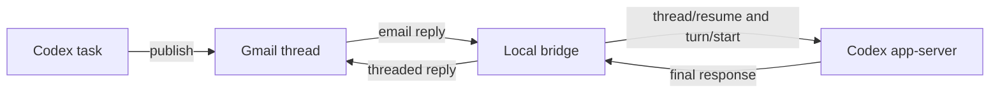

# Gmail Codex Bridge

Gmail Codex Bridge connects a Gmail thread to a Codex task on Windows. You can publish a report from Codex, reply to it by email, and continue the same task without copying messages between applications.

The bridge runs locally. It polls Gmail, accepts mail from one configured sender, and talks to the `codex app-server` process bundled with Codex Desktop. Empty polls do not start Codex or make a model request.

> [!IMPORTANT]
> This project gives an approved email sender access to Codex in the configured project directories. It is intended for a trusted, single-user setup. Review the [security model](#security-model) before running it.

## How it works



Each Gmail thread maps to one Codex task. The bridge stores that route in SQLite and resumes the same task when a new reply arrives. A new email sent directly to the bridge can also start a named Codex task in a configured project.

Outgoing messages contain both HTML and plain-text parts. The HTML is rendered from the Markdown report, while the plain-text version remains available for clients that do not display HTML.

## Main features

- Two-way routing between Gmail threads and Codex tasks
- New Codex tasks created from incoming email
- Project selection through Gmail plus-address aliases
- Named tasks that remain visible in Codex Desktop
- FIFO processing within each task and configurable parallelism across tasks
- Explicit attachment handling for incoming and outgoing messages
- SQLite-backed deduplication, quarantine, and delivery state
- DPAPI protection for the Gmail OAuth token
- Local storage for configuration, logs, attachments, and routing data

## Requirements

- Windows 10 or 11
- Python 3.11 or later
- Node.js 18 or later
- Codex Desktop installed and signed in, or a compatible `codex` executable in `PATH`
- A Google Cloud project with the Gmail API enabled
- OAuth credentials for a desktop application

The bridge uses the experimental `codex app-server` interface. The current workflow was tested with Codex CLI 0.144.3. After updating Codex, run the checks in [Testing](#testing) before restarting the service.

## Quick start

Clone the repository and install it from PowerShell:

```powershell
git clone https://github.com/jeff10080/gmail-codex-bridge.git
Set-Location gmail-codex-bridge
.\scripts\install.ps1
```

The installer creates a virtual environment, installs the project and its development dependencies, and copies the example configuration to:

```text
%LOCALAPPDATA%\CodexGmailBridge\config.toml
```

Next:

1. Create OAuth desktop credentials in Google Cloud and enable the Gmail API.
2. Save the downloaded file as `%LOCALAPPDATA%\CodexGmailBridge\credentials.json`.
3. Edit `%LOCALAPPDATA%\CodexGmailBridge\config.toml`.
4. Authorize the Gmail account.
5. Run the bridge in the foreground for the first test.

```powershell
.\.venv\Scripts\gmail-codex-bridge.exe auth
.\.venv\Scripts\gmail-codex-bridge.exe run
```

The authorization command opens a browser for Google consent. To switch accounts later, run:

```powershell
.\.venv\Scripts\gmail-codex-bridge.exe auth --reauthorize
```

The bridge requests the `gmail.modify` scope. It does not request the broader `mail.google.com` scope.

## Configuration

The generated configuration starts from [config.example.toml](config.example.toml):

```toml
poll_interval_seconds = 60
allowed_sender = "user@example.com"
recipient = "user@example.com"
gmail_account = "bridge@example.com"
max_parallel_threads = 4
gmail_query = "in:inbox from:user@example.com"
codex_working_directory = "C:\\path\\to\\git-repository"
default_project = "home"
log_level = "INFO"

[projects]
home = "C:\\path\\to\\default-project"
second-project = "C:\\path\\to\\second-project"
```

The account fields have separate roles:

| Setting | Purpose |
| --- | --- |
| `gmail_account` | Gmail account authenticated through OAuth and monitored by the bridge |
| `allowed_sender` | Exact sender address allowed to submit messages |
| `recipient` | Address that receives reports and Codex replies |
| `gmail_query` | Gmail search query used for polling |

`default_project` must name an entry in `[projects]`. `codex_working_directory` is a fallback for older routes that do not have a stored project.

## Publish a report

Use the CLI to send the first report from an existing Codex task:

```powershell
.\.venv\Scripts\gmail-codex-bridge.exe publish `
  --codex-thread-id THREAD_ID `
  --subject "Codex report" `
  --body-file .\report.md `
  --attachment .\result.pdf
```

The first message creates a Gmail thread and records its route. Later calls with the same Codex task ID reuse that thread. Repeat `--attachment` to send more than one file.

If a requested attachment is missing, the bridge lists the missing path in the email and sends the rest of the report. It does not silently substitute another file.

Any email that should support replies must use this command or the included `gmail-codex-report` skill. Sending the same content through a generic Gmail client does not create the route needed to resume the Codex task.

## Reply from Gmail

Reply normally in the Gmail thread. The bridge removes quoted Gmail or Outlook history and passes only the new reply text to Codex. It does not add a wrapper, technical instruction, or copied thread history.

The Gmail thread ID is the primary route. Each outgoing message also includes a `CX-XXXXXX` routing code. If Gmail places a reply in a new thread, the code lets the bridge recover the existing route and release a matching quarantined message.

The bridge calls `thread/resume` followed by `turn/start`, so the reply becomes a real user message in the original Codex task. Do not forward the reply through another Codex task or an inter-task messaging tool.

## Start a task by email

Send a new email to the bridge account to create a Codex task. The recipient address selects the working directory:

- `bridge@example.com` uses `default_project`.
- `bridge+second-project@example.com` uses the matching key in `[projects]`.

Gmail delivers plus-address aliases to the same mailbox. Once the task is created, the bridge stores its project and route in SQLite. Later replies continue in that task even if the project name is no longer present in the email body.

The email subject becomes the Codex task name. If the subject is empty, the bridge uses `Conversation Gmail`.

An unknown alias is quarantined and never starts Codex. Keep project keys simple and stable, for example `home`, `analysis-2026`, or `no-project`.

## Attachments in Codex responses

When Codex answers an email and needs to return local files, its final response must contain an `## Attachments` section with one explicit local Markdown link per file:

```markdown
## Attachments

- [Analysis report](C:/path/to/report.pdf)
- [Results](C:/path/to/results.csv)
```

Only local links under that heading become email attachments. Links elsewhere in the response and remote URLs are ignored. This rule prevents a file mentioned as a reference from being sent by accident.

Incoming Gmail attachments are saved under `%LOCALAPPDATA%\CodexGmailBridge\attachments`.

## Run in the background

After the foreground test succeeds, start the bridge without a visible console window:

```powershell
.\scripts\start.ps1
```

Stop it with:

```powershell
.\scripts\stop.ps1
```

The start and stop scripts also work with an existing Windows scheduled task named `Codex Gmail Bridge`. Scheduled-task creation is machine-specific and is not included in the public repository.

To unregister that task while keeping local data:

```powershell
.\scripts\uninstall.ps1
```

To remove the task and all private bridge data, including the database, OAuth token, logs, and downloaded attachments, use the explicit destructive option:

```powershell
.\scripts\uninstall.ps1 -DeletePrivateData
```

PowerShell asks for confirmation before either action.

## Delivery and recovery behavior

- Gmail message IDs provide ingestion idempotency.
- SQLite preserves a FIFO queue for each Codex task.
- Different tasks can run concurrently up to `max_parallel_threads`.
- Jobs interrupted while running return to the queue when the service restarts.
- Messages without a known route or configured project remain quarantined.
- A send that fails after delivery may have occurred is marked `uncertain` and is not retried automatically. This avoids duplicate email.

## Security model

The bridge is designed for one trusted sender and one local Windows account.

- The sender address must match `allowed_sender` exactly.
- New tasks can run only in directories listed under `[projects]`.
- OAuth authorization must match `gmail_account`.
- The OAuth token is encrypted with Windows DPAPI for the current user and machine.
- Private state stays outside the repository under `%LOCALAPPDATA%\CodexGmailBridge`.
- Logs contain identifiers, states, and errors, but not complete email bodies.
- Email bodies and routing records are stored in the local SQLite database.

Email sender checks are not a substitute for a multi-user authorization system. Do not expose this service to untrusted senders or configure project directories that contain data the approved sender should not access.

## Testing

The automated tests use local fakes and do not connect to Gmail or Codex:

```powershell
.\.venv\Scripts\python.exe -m pytest
node --check scripts\codex-runner.mjs
codex app-server --help
```

Run all three checks after changing the bridge or updating Codex.

## Documentation

- [Windows installation guide](docs/INSTALLATION.md)
- [Architecture notes](docs/ARCHITECTURE.md)

## License

No license file is currently included. Treat the repository as all rights reserved unless the owner adds a license.
